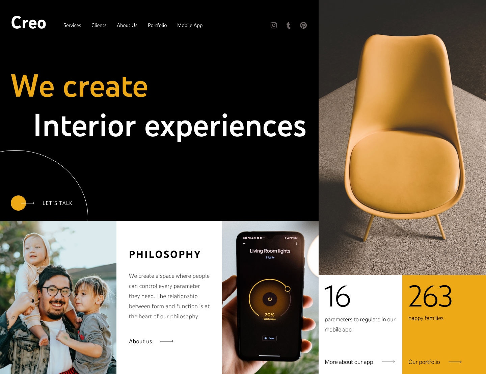

# **What we'll be building**



Check the original design on [Dribbble](https://dribbble.com/shots/19738577-Interior-website-design-landing-page-home-page-ui) by Ramotion.

I did not have access to their original assets, so I made some (very) slight adjustments.

## **Colors**

1. Yellow - #EDA915
2. Black - #000000
3. Paragraphs - #434343

## **Fonts**

YouTube Sans - Check "fonts" folder.

How to use local fonts in CSS:

```
/* This example uses the light font weight */

@font-face {
  font-family: youtubesanslight;
  /* The name you give here is completely dependent on you. */
  src: url("/fonts/youtube-sans-light.ttf");
  /* Link the font you want. */
}

/* This example uses the bold font weight */

@font-face {
  font-family: youtubesansbold;
  src: url("/fonts/youtube-sans-bold.ttf");
}
```

## **NOTE**

You can use multiple `@font-face`s. Just remember to define them on the proper elements, or on the elements that you want the respective font to apply.

## **Full example**

```
@font-face {
  font-family: youtubesanslight;
  src: url("/fonts/youtube-sans-light.ttf");
}

@font-face {
  font-family: youtubesansbold;
  src: url("/fonts/youtube-sans-bold.ttf");
}

/* This heading uses the bold font weight. */
h1 {
  font-family: youtubesansbold;
}

/* This paragraph uses the light font weight. */
p {
  font-family: youtubesanslight;
}
```

Thank you.

[YouTube Channel](https://youtube.com/@tsbsankara)
